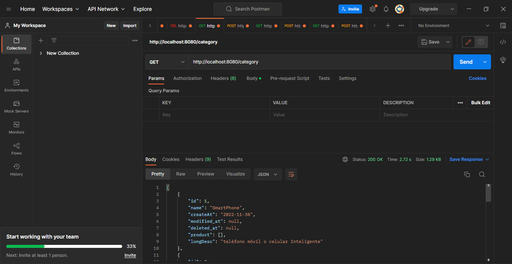
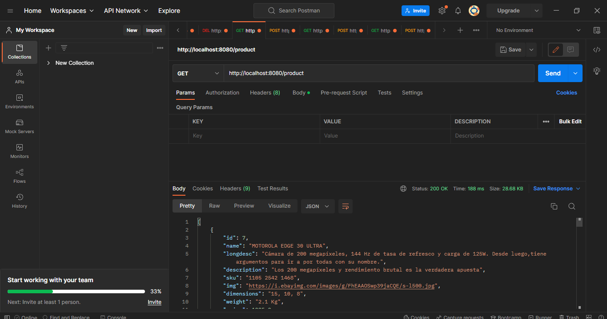

 

  

  <h1 style="font-size: 60px; font-weight: 700" align="center">🛒KMarket Ecommerce</h1>

<h4 align="center">

  
https://k-market-ten.vercel.app/

</h4>
 

"Del campo a tu mesa, frescura y calidad sin intermediarios"
     
     
   
Bienvenido a Kmarket, una plataforma de eCommerce diseñada para ofrecerte la mejor experiencia de compra en línea! Como empresa en línea, nos enorgullece ofrecerte una amplia variedad de productos de alta calidad a precios asequibles.
  

<!-- markdownlint-disable MD051-->

## Tabla de Contenidos

- [🛠️Construido con](#🖥️🛠️Herramientas)
- [📃Requisitos](#📃requisitos)
- [🛠️Instalación](#🛠️instalación)
- [🎞️Capturas](#🎞️capturas)
- [🤝Contacto](#🤝contacto)
- [🙏Agradecimientos](#🙏agradecimientos)
<!-- markdownlint-enable MD051-->

## Construido con

- Spring Boot 3.0.1
- JAVA 17
- Maven
- Eureka Netflix
- Feign Client
- Spring Boot Security
- Spring Boot Gateway
- Postman

## Requisitos

- Java 17
- Maven
- Git (Git Desktop)
- Un editor de código o IDE compatible con los lenguajes mencionados anteriormente(IntelliJ IDEA, STS)
- PotsgresQL

## instalación

### Configuración

- Clona este reposiotrio utilizando `https://github.com/LuisRAnrrango/E-Commerce-KrugerS.git`
- Es necesario tener instalado el JDK para Java 17.
- Postman u otra herramienta como Thunder Client o Insonmia para el test de la API

### Pasos

- Primero abrir el proyecto `config-service`, este tiene centralizado los archivos de configuración de cada microservicio, ejectuar el proyecto con el IDE de confianza, se ejecutará en el puerto `8180`

- Segundo abrir el proyecto `eureka-service`, este microservicio mantiene el registro de los microservicios del proyecto a manos de Eureka, ejectuar el proyecto con el IDE de confianza, se ejecuturá en el puerto `8761`

- Tercero abrir el proyecto `gateway-service`, este microservicio contiene la puerta de enlace para los microservicios, se ejecutará en el puerto `8080`

- Cuarto abrir el proyecto `msvc-producto`, este microservicio contiene la API de los productos, ejecutar el proyecto con el IDE de confianza, se ejecturá en un puerto randómico `????`

- Quinto abrir el proyecto `msvc-negocios`, este microservicio contiene la API de los negocios o Compañia , ejecutar el proyecto con el IDE de confianza , se ejecutará en un puerto randómico `????`

- Sexto abrir el proyecto `msvc-estadopedidos`, este microservicio contiene la API de los diferentes estados de venta, ejecutar el proyecto con el IDE de confianza, se ejecutará en un puerto randómico `????`

- Finalmente abrir el proyecto `backend`, este microservicio contiene los Usuarios de la aplicación , ejecutar el proyecto con el IDE de confianza , se ejecutará en un puerto randómico `????`

## 🎞️Capturas

<table>
    <tr>
        <th>
Ejecución de Categoria
</th>
        <th>
Ejecución de Productos
</th>
    </tr>
    <tr>
        <td rowspan="3"></td>
        <td></td>
    </tr>
</table>

## Contacto

  <table>
    <tbody>
        <tr>
        <td align="center"><a href="https://github.com/LuisRAnrrango"> <b>Luis Anrrango</b></a> <a href="https://github.com/LuisRAnrrango" title="Code">💻 Desarrollador</a></td>
        </tr>
<tr>
        <td align="center"><a href="https://github.com/Piguave"> <b>Ariel Piguave</b></a> <a href="https://github.com/Piguave" title="Code">💻 Desarrollador</a></td>
        </tr>
        <tr>
        <td align="center"><a href="https://github.com/jeici21"> <b></b></a> <a href="https://github.com/jeici21" title="Code">💻 Desarrollador</a></td>
        </tr>
         
    </tbody>
</table>

## 🙏Agradecimientos

- [José Gavilanes](https://github.com/joseandresgavilanes), por su inestimable ayuda embelleciendo la página web.
- [Kenan Al-jaber](https://github.com/KenanAljaber), por ayudarnos a resolver los problemas que teníamos en nuestros microservicios de backend.
- [Ing. Juan Sotomayor](https://github.com/Juanse7793), por las clases de React que nos permitieron enfocarnos en un etorno FrontEnd y además prepararnos para nuestro futuro profesional.
- [Ing. Jaime Sayago](https://github.com/jaimepsayago), por las enseñanzas de Spring Boot tan valiosas para volvernos desarrolladores backend.
